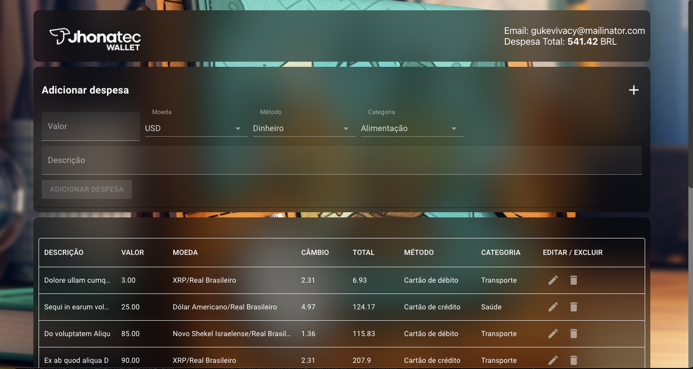
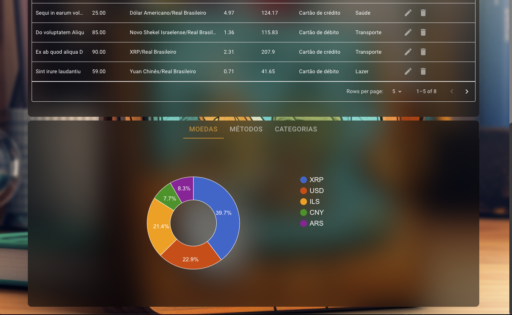

# trybe-wallet by Jhonatec
Application that uses the Currencies API to register expenses with the current quotation value

## Watch online

<a href="https://wallet.jhonatec.dev/" target="_blank">Click here to open preview</a>

# Functionalities

- Login with email validation
- Main currencies with values updated by the API https://economia.awesomeapi.com.br/
- Record and display in DataGrid
- Real-time graphs of registered expenses

# Technologies used

- React JS
    - redux
    - React Google Chart
    - MUI Components
    - Class Components

# Changelog

- 05/18/2023 - Base project finalized